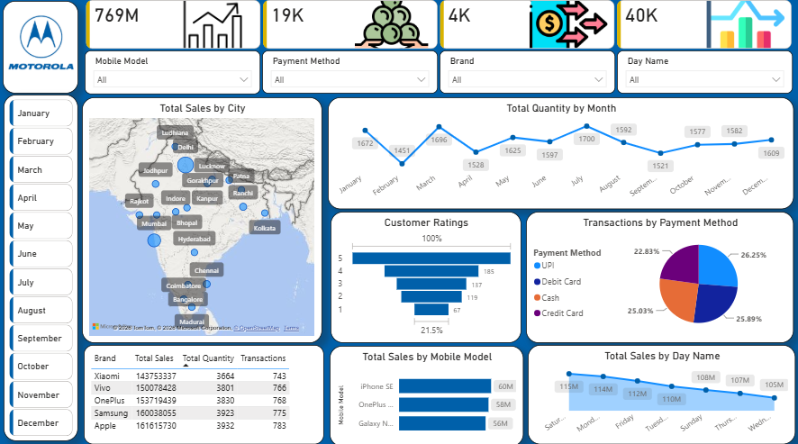
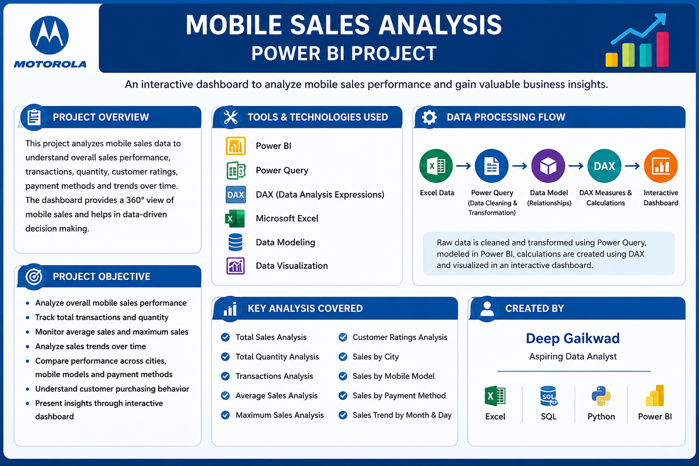

# 📱 Mobile Sales Analysis Dashboard | Power BI

## 📊 Project Overview

This project is an interactive **Mobile Sales Analysis Dashboard** developed using **Microsoft Power BI**.

The dashboard transforms raw mobile sales data into meaningful business insights by analyzing sales performance, transactions, quantity sold, customer ratings, payment methods, brands, mobile models, cities, and sales trends.

The main objective of this project is to demonstrate how Power BI can be used for **data cleaning, transformation, analysis, visualization, and interactive business reporting**.

---

## 🎯 Project Objectives

- Analyze overall mobile sales performance
- Track total sales, transactions, and quantity sold
- Analyze monthly and daily sales trends
- Compare sales performance across cities
- Analyze sales by mobile brands and models
- Understand customer rating distribution
- Analyze different payment methods
- Identify important sales patterns and trends
- Build an interactive and user-friendly Power BI dashboard
- Present business insights through effective data visualization

---

## 🛠️ Tools & Technologies

- **Microsoft Power BI**
- **Power Query**
- **DAX**
- **Microsoft Excel**
- **Data Cleaning**
- **Data Transformation**
- **Data Modeling**
- **Data Visualization**

---

## 📌 Key KPIs

The dashboard includes important Key Performance Indicators such as:

- 💰 Total Sales
- 🛒 Total Transactions
- 📦 Total Quantity
- 📊 Average Sales
- 📈 Maximum Sales
- ⭐ Customer Ratings
- 💳 Payment Method Analysis

---

## 📈 Dashboard Features

The Power BI dashboard provides:

- Sales Performance Analysis
- Sales by City
- Sales by Brand
- Sales by Mobile Model
- Monthly Sales Trends
- Daily Sales Analysis
- Quantity Analysis
- Transaction Analysis
- Customer Rating Analysis
- Payment Method Analysis
- Interactive Slicers and Filters
- KPI Cards
- Charts and Data Visualizations

---

## 📊 Dashboard Pages

### 📱 Mobile Sales Dashboard

The main dashboard provides an interactive overview of mobile sales performance using KPI cards, charts, tables, maps, and slicers.

Users can filter and explore the data based on different dimensions such as date, city, brand, mobile model, payment method, and other available categories.

### 📋 Project Information

A dedicated **Project Information** page provides an overview of the project, including project objectives, tools and technologies used, analysis process, and author information.

---

## 🖼️ Dashboard Preview

### 📱 Mobile Sales Dashboard

### 📋 Project Information

---

## 📂 Project Files

| File / Folder | Description |
|---|---|
| `Mobile Sales Dashboard.pbix` | Power BI dashboard file |
| `Mobile Sales Data.xlsx` | Dataset used for analysis |
| `Icon/` | Icons used in the dashboard |
| `image/` | Dashboard screenshots and project preview images |
| `README.md` | Project documentation |

---

## 🔄 Data Analysis Process

The project follows a basic data analytics workflow:

**Raw Data → Data Cleaning → Data Transformation → Data Modeling → DAX Analysis → Data Visualization → Business Insights**

Power Query was used for data preparation and transformation, while DAX was used to create calculations and measures required for dashboard analysis.

---

## 🚀 How to Use

1. Download or clone this repository.
2. Open `Mobile Sales Dashboard.pbix` using **Power BI Desktop**.
3. If required, update the Excel data source path.
4. Refresh the dataset.
5. Use the available slicers and filters to explore the dashboard.
6. Analyze the sales trends and business insights through the visualizations.

---

## 📚 Skills Demonstrated

This project demonstrates practical knowledge of:

- Power BI
- Power Query
- DAX
- Microsoft Excel
- Data Cleaning
- Data Transformation
- Data Modeling
- Data Visualization
- Dashboard Development
- Business Analysis
- Interactive Reporting

---

## 👨‍💻 Author

**Deep Gaikwad**

Aspiring Data Analyst

**Skills:**  
Excel | SQL | Python | Power BI | Data Analysis

---

## ⭐ Conclusion

This project demonstrates the use of **Power BI for transforming raw sales data into an interactive and informative business dashboard**.

It highlights practical skills in data preparation, analysis, visualization, dashboard development, and business reporting.

Thank you for visiting this project! ⭐

If you find this project useful, feel free to explore the repository.
